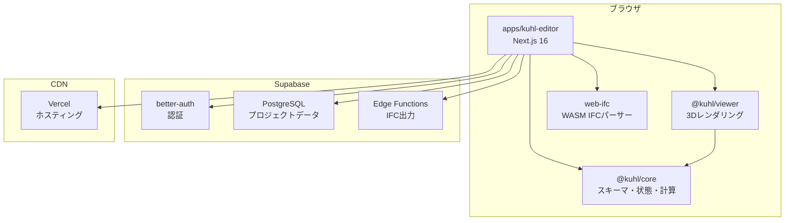

# Kühl HVAC Editor アーキテクチャ設計

**作成日**: 2026-03-23
**関連要件定義**: [requirements.md](../../spec/kuhl-hvac-editor/requirements.md)
**ヒアリング記録**: [design-interview.md](design-interview.md)

**【信頼性レベル凡例】**:
- 🔵 **青信号**: EARS要件定義書・設計文書・ユーザヒアリングを参考にした確実な設計
- 🟡 **黄信号**: EARS要件定義書・設計文書・ユーザヒアリングから妥当な推測による設計
- 🔴 **赤信号**: EARS要件定義書・設計文書・ユーザヒアリングにない推測による設計

---

## システム概要 🔵

**信頼性**: 🔵 *要件定義書概要・設計文書 §1.1*

Kühlは空調設備の基本設計フェーズに特化したWebベースの3D BIMエディタである。既存のPascal Editor V2の共通基盤（BaseNode, useScene, event bus, React Three Fiber）をフォーク・コピーし、建築ノードを削除して空調設備専用に再構成する。

**ターゲットユーザー**: 社内の空調設備設計担当者
**対象業務**: 空調負荷計算、機器選定、ダクト/配管ルーティング、数量拾い、IFC出力
**MVPスコープ**: Phase 0（骨格準備）+ Phase 1（ゾーニング+負荷概算）+ Phase 2（機器配置）

## アーキテクチャパターン 🔵

**信頼性**: 🔵 *既存Pascal Editorアーキテクチャ・CLAUDE.md*

- **パターン**: 既存Pascal Editor V2のレイヤードアーキテクチャを踏襲
  - **Core層**: 純粋ロジック（スキーマ、状態管理、計算エンジン）— React/Three.js非依存
  - **Viewer層**: 3Dレンダリング（レンダラー、ビューアシステム）— React Three Fiber依存
  - **Editor層**: エディタUI・ツール — アプリケーション固有
- **選択理由**: 既存の実績あるパターンを踏襲することで、開発効率と品質を確保。Viewer Isolation原則を維持。

## コンポーネント構成

### モノレポ構成 🔵

**信頼性**: 🔵 *ユーザヒアリング: 同一モノレポ・並存*

```
web-bim-editor/                    # 既存モノレポ（@pascal-app/* は残存）
├── apps/
│   ├── editor/                    # 既存 Pascal Editor（維持）
│   └── kuhl-editor/               # 新規 Kühl Editor アプリケーション
│       ├── app/                    # Next.js 16 App Router
│       ├── components/
│       │   ├── tools/              # 空調設備ツール群
│       │   │   ├── zone-draw-tool.tsx
│       │   │   ├── ahu-place-tool.tsx
│       │   │   ├── pac-place-tool.tsx
│       │   │   ├── diffuser-place-tool.tsx
│       │   │   ├── duct-route-tool.tsx
│       │   │   └── pipe-route-tool.tsx
│       │   ├── panels/             # UI パネル
│       │   │   ├── zone-list-panel.tsx
│       │   │   ├── system-tree-panel.tsx
│       │   │   ├── property-panel.tsx
│       │   │   ├── spec-sheet-panel.tsx
│       │   │   └── takeoff-panel.tsx
│       │   └── tool-manager.tsx
│       └── store/
│           └── use-editor.tsx      # Kühl Editor 状態管理
│
├── packages/
│   ├── core/                       # 既存 @pascal-app/core（維持）
│   ├── viewer/                     # 既存 @pascal-app/viewer（維持）
│   ├── editor/                     # 既存 @pascal-app/editor（維持）
│   ├── ui/                         # 共有UI @repo/ui（共用）
│   │
│   ├── kuhl-core/                  # 新規 @kuhl/core
│   │   ├── src/
│   │   │   ├── schema/
│   │   │   │   ├── base.ts         # BaseNode（フォーク）
│   │   │   │   ├── types.ts        # AnyNode ユニオン（空調ノード）
│   │   │   │   └── nodes/          # 空調ノードスキーマ（21種）
│   │   │   ├── store/
│   │   │   │   ├── use-scene.ts    # useScene（フォーク）
│   │   │   │   └── actions/
│   │   │   ├── systems/
│   │   │   │   ├── zone/           # 負荷計算
│   │   │   │   ├── equipment/      # 機器選定
│   │   │   │   ├── duct/           # ダクト寸法・圧損
│   │   │   │   ├── pipe/           # 配管口径・圧損
│   │   │   │   ├── takeoff/        # 数量拾い
│   │   │   │   └── ifc/            # IFC読込・出力
│   │   │   ├── events/
│   │   │   │   └── bus.ts          # イベントバス（フォーク）
│   │   │   └── hooks/
│   │   │       └── scene-registry/ # sceneRegistry（フォーク）
│   │   └── package.json
│   │
│   └── kuhl-viewer/                # 新規 @kuhl/viewer
│       ├── src/
│       │   ├── components/
│       │   │   ├── renderers/      # 空調ノード用レンダラー
│       │   │   │   ├── zone-renderer.tsx
│       │   │   │   ├── equipment-renderer.tsx
│       │   │   │   ├── diffuser-renderer.tsx
│       │   │   │   ├── duct-renderer.tsx
│       │   │   │   ├── pipe-renderer.tsx
│       │   │   │   ├── architecture-ref-renderer.tsx
│       │   │   │   └── node-renderer.tsx
│       │   │   └── viewer.tsx       # メインViewerコンポーネント
│       │   ├── store/
│       │   │   └── use-viewer.ts    # useViewer（フォーク）
│       │   ├── systems/             # ビューアシステム
│       │   │   ├── level-visibility-system.tsx
│       │   │   └── interactive-system.tsx
│       │   └── hooks/
│       │       └── use-node-events.ts
│       └── package.json
```

### パッケージ依存関係 🔵

**信頼性**: 🔵 *既存アーキテクチャ・Viewer Isolation原則*

```
apps/kuhl-editor
├── @kuhl/core          (空調スキーマ、状態管理、計算エンジン)
├── @kuhl/viewer        (3Dビューポート、レンダラー)
└── @repo/ui            (共有UIコンポーネント)

@kuhl/viewer → depends on @kuhl/core (peer)
@kuhl/core   → no internal deps (純粋ロジック、React/Three.js非依存)
```

**重要**: `@kuhl/viewer` は `apps/kuhl-editor` からインポート禁止（Viewer Isolation原則）

### 3ストアアーキテクチャ 🔵

**信頼性**: 🔵 *既存3ストアパターンの踏襲・設計文書 §4.1*

| ストア | パッケージ | 用途 |
|--------|-----------|------|
| `useScene` | `@kuhl/core` | フラットノード辞書（空調ノード21種）、CRUD、ダーティ追跡、undo/redo（Zundo）、IndexedDB永続化 |
| `useViewer` | `@kuhl/viewer` | 選択パス（Plant→Building→Level→HvacZone→要素）、カメラ、テーマ、表示トグル、LOD設定 |
| `useEditor` | `apps/kuhl-editor` | アクティブツール、フェーズ（zone/equip/route/calc/takeoff）、モード（select/edit/delete/build） |

### フロントエンド 🔵

**信頼性**: 🔵 *tech-stack.md・既存実装*

- **フレームワーク**: Next.js 16（App Router）+ React 19
- **3Dエンジン**: Three.js (WebGPU) + React Three Fiber + Drei
- **状態管理**: Zustand 5 + Zundo（undo/redo）
- **バリデーション**: Zod 4（ノードスキーマ）
- **UIコンポーネント**: Radix UI + Tailwind CSS 4
- **IFC読込**: web-ifc（WASM、メインスレッド）
- **イベントバス**: mitt（型付きイベントエミッター）
- **ID生成**: nanoid（プレフィックス付きID: `zone_abc123`, `ahu_def456`）

### バックエンド 🔵

**信頼性**: 🔵 *ユーザヒアリング: 既存仕組み継続*

- **データベース**: Supabase PostgreSQL + Drizzle ORM
- **認証**: better-auth（既存の認証基盤を継続使用）
- **クライアント永続化**: IndexedDB（オフラインキャッシュ用）
- **IFC出力**: Supabase Edge Functions（IfcOpenShell — 技術検証必要）🟡
- **デプロイ**: Vercel

### IFC出力バックエンド 🟡

**信頼性**: 🟡 *ユーザヒアリング: Edge Functions選択だが技術検証必要*

- **第一候補**: Supabase Edge Functions + IfcOpenShell
- **代替案**: 専用Pythonサーバー（IfcOpenShell on Docker）
- **備考**: Edge Functionsの実行時間・メモリ制限内でIFC生成が可能か要検証

## システム構成図



**信頼性**: 🔵 *既存インフラ構成・ユーザヒアリング*

## ディレクトリ構造 🔵

**信頼性**: 🔵 *既存プロジェクト構造・ユーザヒアリング*

```
packages/kuhl-core/src/
├── schema/
│   ├── base.ts                    # BaseNode（@pascal-app/coreからフォーク）
│   ├── camera.ts
│   ├── types.ts                   # AnyNode ユニオン（空調21種）
│   └── nodes/
│       ├── plant.ts               # PlantNode（施設）
│       ├── building.ts            # BuildingNode
│       ├── level.ts               # LevelNode
│       ├── hvac-zone.ts           # HvacZoneNode（空調ゾーン）
│       ├── hvac-equipment-base.ts # HvacEquipmentBase + PortDef
│       ├── ahu.ts                 # AhuNode（空調機）
│       ├── pac.ts                 # PacNode（パッケージエアコン）
│       ├── fcu.ts                 # FcuNode
│       ├── vrf-outdoor.ts         # VrfOutdoorNode
│       ├── vrf-indoor.ts          # VrfIndoorNode
│       ├── diffuser.ts            # DiffuserNode（制気口）
│       ├── damper.ts              # DamperNode
│       ├── fan.ts                 # FanNode
│       ├── pump.ts                # PumpNode
│       ├── chiller.ts             # ChillerNode
│       ├── boiler.ts              # BoilerNode
│       ├── cooling-tower.ts       # CoolingTowerNode
│       ├── duct-segment.ts        # DuctSegmentNode
│       ├── duct-fitting.ts        # DuctFittingNode
│       ├── pipe-segment.ts        # PipeSegmentNode
│       ├── pipe-fitting.ts        # PipeFittingNode
│       ├── valve.ts               # ValveNode
│       ├── system.ts              # SystemNode（系統）
│       ├── support.ts             # SupportNode
│       └── architecture-ref.ts    # ArchitectureRefNode（IFC表示のみ）
├── store/
│   ├── use-scene.ts               # useScene（フォーク、Zundo付き）
│   └── actions/
│       └── node-actions.ts        # CRUD操作
├── systems/
│   ├── zone/
│   │   └── load-calc-system.ts    # 空調負荷概算（m²単価法）
│   ├── equipment/
│   │   ├── equipment-system.ts    # 配置・ポート位置計算
│   │   ├── ahu-selection.ts       # AHU機器選定
│   │   ├── pac-selection.ts       # PAC/VRF機器選定
│   │   └── pump-selection.ts      # ポンプ選定
│   ├── duct/
│   │   ├── duct-system.ts         # ダクトジオメトリ生成
│   │   ├── duct-sizing.ts         # ダクト寸法選定
│   │   └── duct-pressure-loss.ts  # ダクト圧損計算
│   ├── pipe/
│   │   ├── pipe-system.ts         # 配管ジオメトリ生成
│   │   ├── pipe-sizing.ts         # 配管口径選定
│   │   └── pipe-pressure-loss.ts  # 配管圧損計算
│   ├── takeoff/
│   │   ├── quantity-takeoff.ts    # 数量拾い出し
│   │   └── cost-export.ts         # 積算出力
│   └── ifc/
│       ├── ifc-import.ts          # 建築IFC読込
│       └── ifc-export.ts          # 設備IFC出力
├── events/
│   └── bus.ts                     # イベントバス（フォーク）
├── hooks/
│   └── scene-registry/
│       └── scene-registry.ts      # sceneRegistry（フォーク）
└── index.ts                       # パッケージエクスポート
```

## ノード階層 🔵

**信頼性**: 🔵 *設計文書 §2.1*

```
Plant（施設）
└── Building（建物）── ArchitectureRef（IFC建築躯体、表示のみ）
    └── Level（階）
        └── HvacZone（空調ゾーン）
            ├── 空調機器: AHU, PAC, FCU, VrfOutdoor, VrfIndoor, Diffuser, Damper, Fan
            ├── ダクト: DuctSegment, DuctFitting
            ├── 配管: PipeSegment, PipeFitting, Valve
            ├── 熱源: Pump, Chiller, Boiler, CoolingTower
            └── 支持: Support
```

フラット辞書 `Record<id, AnyNode>` に格納。`parentId` で階層表現。

## フェーズ＋ツールマッピング 🔵

**信頼性**: 🔵 *設計文書 §4.1*

```typescript
type Phase = 'zone' | 'equip' | 'route' | 'calc' | 'takeoff'
type Mode = 'select' | 'edit' | 'delete' | 'build'

const phaseTools: Record<Phase, string[]> = {
  zone:    ['select', 'zone_draw', 'zone_edit', 'load_calc'],
  equip:   ['select', 'ahu_place', 'pac_place', 'diffuser_place', 'fan_place'],
  route:   ['select', 'duct_route', 'pipe_route', 'auto_route'],
  calc:    ['select', 'pressure_loss', 'system_balance', 'clash_check'],
  takeoff: ['select', 'takeoff_run', 'cost_export'],
}
```

## システム（計算エンジン）パターン 🔵

**信頼性**: 🔵 *既存Systemパターン・設計文書 §3*

既存のuseFrameベースのシステムパターンを踏襲:

```typescript
// パターン: packages/kuhl-core/src/systems/zone/load-calc-system.ts
export const LoadCalcSystem = () => {
  const dirtyNodes = useScene((state) => state.dirtyNodes)
  const clearDirty = useScene((state) => state.clearDirty)

  useFrame(() => {
    if (dirtyNodes.size === 0) return
    const nodes = useScene.getState().nodes

    dirtyNodes.forEach((id) => {
      const node = nodes[id]
      if (node?.type !== 'hvac_zone') return

      const result = calculateZoneLoad(node)
      useScene.getState().updateNode(id, { loadResult: result })
      clearDirty(id)
    })
  }, 2) // 高優先度: ゾーン負荷計算

  return null
}
```

### システム一覧と優先度

| システム | フェーズ | useFrame優先度 | 役割 |
|---------|---------|---------------|------|
| LoadCalcSystem | Phase 1 | 2 | ゾーン負荷概算（m²単価法） |
| EquipmentSystem | Phase 2 | 3 | 機器配置・ポート位置計算 |
| DuctSystem | Phase 3 | 4 | ダクトジオメトリ生成（ExtrudeGeometry） |
| DuctSizingSystem | Phase 3 | 5 | ダクト寸法自動選定 |
| DuctPressureLossSystem | Phase 3 | 6 | ダクト圧損リアルタイム計算 |
| PipeSystem | Phase 4 | 4 | 配管ジオメトリ生成 |
| PipeSizingSystem | Phase 4 | 5 | 配管口径選定 |
| PipePressureLossSystem | Phase 4 | 6 | 配管圧損計算 |

## レンダラーパターン 🔵

**信頼性**: 🔵 *既存Rendererパターン*

```typescript
// パターン: packages/kuhl-viewer/src/components/renderers/equipment-renderer.tsx
export const EquipmentRenderer = ({ node }: { node: AhuNode | PacNode | ... }) => {
  const ref = useRef<Group>(null!)
  useRegistry(node.id, node.type, ref)
  const handlers = useNodeEvents(node, node.type)

  return (
    <group ref={ref} position={node.position} rotation={node.rotation} {...handlers}>
      {node.lod === '100' ? (
        <BoxRenderer dimensions={node.dimensions} color={equipmentColor[node.type]} />
      ) : (
        <Suspense fallback={<BoxRenderer dimensions={node.dimensions} />}>
          {node.modelSrc ? (
            <GlbModelRenderer src={node.modelSrc} />
          ) : (
            <ProceduralEquipment type={node.type} dimensions={node.dimensions} />
          )}
        </Suspense>
      )}
      <TagLabel text={node.tag} />
      <PortMarkers ports={node.ports} />
    </group>
  )
}
```

### ダクトレンダラー 🟡

**信頼性**: 🟡 *ユーザヒアリング: ExtrudeGeometry選択 + 既存パターンから推測*

```typescript
// パターン: packages/kuhl-viewer/src/components/renderers/duct-renderer.tsx
export const DuctRenderer = ({ node }: { node: DuctSegmentNode }) => {
  const ref = useRef<Mesh>(null!)
  useRegistry(node.id, 'duct_segment', ref)
  const handlers = useNodeEvents(node, 'duct_segment')

  // ExtrudeGeometryで断面形状を中心線に沿って押し出し
  const geometry = useMemo(() => {
    const shape = node.shape === 'rectangular'
      ? createRectShape(node.width!, node.height!)
      : createCircleShape(node.diameter!)
    const path = createLinePath(node.start, node.end)
    return new ExtrudeGeometry(shape, { extrudePath: path })
  }, [node])

  return (
    <mesh ref={ref} geometry={geometry} {...handlers}>
      <meshStandardMaterial color={ductColor[node.medium]} />
    </mesh>
  )
}
```

## イベントバス拡張 🔵

**信頼性**: 🔵 *既存イベントバスパターン*

既存のmittベースのイベントバスに空調ノードイベントを追加:

```typescript
type KuhlEvents =
  // ゾーン
  NodeEvents<'hvac_zone', HvacZoneEvent> &
  // 機器
  NodeEvents<'ahu', EquipmentEvent> &
  NodeEvents<'pac', EquipmentEvent> &
  NodeEvents<'fcu', EquipmentEvent> &
  NodeEvents<'diffuser', DiffuserEvent> &
  // ダクト・配管
  NodeEvents<'duct_segment', DuctEvent> &
  NodeEvents<'pipe_segment', PipeEvent> &
  // グリッド・カメラ
  GridEvents &
  CameraControlEvents &
  ToolEvents
```

## sceneRegistry拡張 🔵

**信頼性**: 🔵 *既存sceneRegistryパターン*

```typescript
export const sceneRegistry = {
  nodes: new Map<string, THREE.Object3D>(),
  byType: {
    plant: new Set<string>(),
    building: new Set<string>(),
    level: new Set<string>(),
    hvac_zone: new Set<string>(),
    ahu: new Set<string>(),
    pac: new Set<string>(),
    fcu: new Set<string>(),
    diffuser: new Set<string>(),
    duct_segment: new Set<string>(),
    duct_fitting: new Set<string>(),
    pipe_segment: new Set<string>(),
    pipe_fitting: new Set<string>(),
    valve: new Set<string>(),
    // ... 全ノードタイプ
  },
}
```

## 非機能要件の実現方法

### パフォーマンス 🟡

**信頼性**: 🟡 *NFR-001~004から妥当な推測*

- **3D描画**: 60fps目標（1000ノード以下）。既存のdirty tracking + useFrameパターンで差分更新のみ実行
- **負荷計算**: 100ゾーン1秒以内。m²単価法は単純な掛け算なので十分達成可能
- **IFC読込**: web-ifc WASMでメインスレッド処理。100MB以下対応。大規模ファイルは将来Worker化を検討
- **ダクト圧損**: リアルタイム更新。useFrame優先度6でルーティング操作中に再計算

### セキュリティ 🔵

**信頼性**: 🔵 *NFR-101, 102・既存実装*

- **認証**: better-auth継続使用。未認証ユーザーはログインページにリダイレクト
- **アクセス制御**: Supabase RLS（Row Level Security）でユーザー単位のプロジェクトアクセス制御
- **データ暗号化**: Supabase標準のTLS通信 + at-rest暗号化

### スケーラビリティ 🟡

**信頼性**: 🟡 *NFR-401~403から妥当な推測*

- **シングルテナント**: MVPではシングルテナント。将来マルチテナント拡張のため `tenantId` フィールドを予約
- **負荷計算拡張**: スキーマに `loadResult` をオプショナルで持たせ、将来ピーク負荷計算に差し替え可能
- **機器カタログ**: `definitionId` フィールドで将来N-BOM連携に対応

### 可用性 🟡

**信頼性**: 🟡 *既存インフラ構成から推測*

- **Vercel**: グローバルCDN + エッジランタイム
- **Supabase**: マネージドPostgreSQL + 自動バックアップ
- **IndexedDB**: クライアントキャッシュで一時的なオフライン操作に対応

### ユーザビリティ 🔵

**信頼性**: 🔵 *NFR-201~203・ユーザヒアリング*

- **言語**: 日本語UI（社内ツール）
- **専門用語**: AHU, PAC, FCU, VRF等はそのまま使用（設備設計者向け）
- **フェーズ切替**: トップバーのワンクリック切替（zone→equip→route→calc→takeoff）

## 技術的制約

### パフォーマンス制約 🔵

**信頼性**: 🔵 *CLAUDE.md・技術スタック*

- WebGPU対応ブラウザ（Chrome/Edge最新版）必須
- web-ifc WASMのメモリ使用量制約（100MB以下のIFCファイル）
- useFrame内の処理は16ms以内に収める（60fps維持）

### セキュリティ制約 🔵

**信頼性**: 🔵 *既存セキュリティ設計*

- Supabase RLSポリシーに準拠
- better-authのセッション管理に依存

### 互換性制約 🔵

**信頼性**: 🔵 *NFR-301, 302・技術スタック*

- **ブラウザ**: Chrome/Edge最新版（WebGPU対応）
- **IFC形式**: IFC 2x3 / IFC 4（web-ifcの対応範囲）
- **積算形式**: CSV / Excel（みつもりくん形式）/ Rebro データリンク形式

### Viewer Isolation原則 🔵

**信頼性**: 🔵 *CLAUDE.md*

- `@kuhl/viewer` は `apps/kuhl-editor` からインポート禁止
- Viewerはprops、callbacks、children injectionで制御
- エディタ固有機能はViewerの子コンポーネントとして注入

## Three.jsレイヤー 🔵

**信頼性**: 🔵 *既存レイヤー定義*

| レイヤー | 定数 | 用途 |
|---------|------|------|
| 0 | `SCENE_LAYER` | 通常ジオメトリ（機器、ダクト、配管） |
| 1 | `EDITOR_LAYER` | エディタヘルパー（ポートマーカー、寸法線） |
| 2 | `ZONE_LAYER` | ゾーンオーバーレイ（半透明着色） |

## 関連文書

- **データフロー**: [dataflow.md](dataflow.md)
- **型定義**: [interfaces.ts](interfaces.ts)
- **DBスキーマ**: [database-schema.sql](database-schema.sql)
- **API仕様**: [api-endpoints.md](api-endpoints.md)
- **ヒアリング記録**: [design-interview.md](design-interview.md)
- **要件定義**: [requirements.md](../../spec/kuhl-hvac-editor/requirements.md)
- **設計文書**: [空調基本設計BIM開発.md](../../空調基本設計BIM開発.md)

## 信頼性レベルサマリー

- 🔵 青信号: 24件 (80%)
- 🟡 黄信号: 6件 (20%)
- 🔴 赤信号: 0件 (0%)

**品質評価**: 高品質 — 大部分が設計文書・ヒアリング・既存実装に裏付けられている。黄信号は主にパフォーマンス目標値とIFC出力バックエンドの技術検証部分。
