# Kühl HVAC Editor データフロー図

**作成日**: 2026-03-23
**関連アーキテクチャ**: [architecture.md](architecture.md)
**関連要件定義**: [requirements.md](../../spec/kuhl-hvac-editor/requirements.md)

**【信頼性レベル凡例】**:
- 🔵 **青信号**: EARS要件定義書・設計文書・ユーザヒアリングを参考にした確実なフロー
- 🟡 **黄信号**: EARS要件定義書・設計文書・ユーザヒアリングから妥当な推測によるフロー
- 🔴 **赤信号**: EARS要件定義書・設計文書・ユーザヒアリングにない推測によるフロー

---

## システム全体のデータフロー 🔵

**信頼性**: 🔵 *既存Pascal Editorデータフロー・CLAUDE.md*

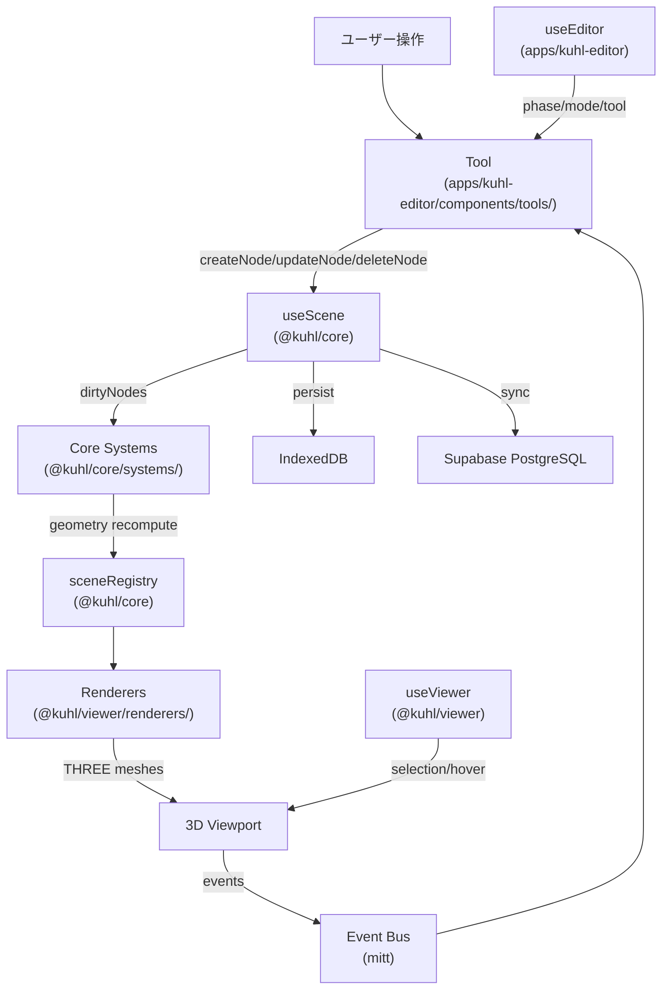

### コアデータフローサイクル 🔵

**信頼性**: 🔵 *CLAUDE.md Data Flow セクション*

```
ユーザー入力 → Tool (apps/kuhl-editor/components/tools/)
  → useScene mutations (createNode/updateNode/deleteNode)
  → Node marked dirty (dirtyNodes Set)
  → Core Systems recompute geometry (useFrame)
  → Renderers re-render THREE meshes
  → useViewer updates selection/hover
```

---

## 主要機能のデータフロー

### 機能1: IFC建築躯体の読込 🔵

**信頼性**: 🔵 *設計文書 §5.1・要件REQ-106, REQ-107*

**関連要件**: REQ-106, REQ-107, REQ-108

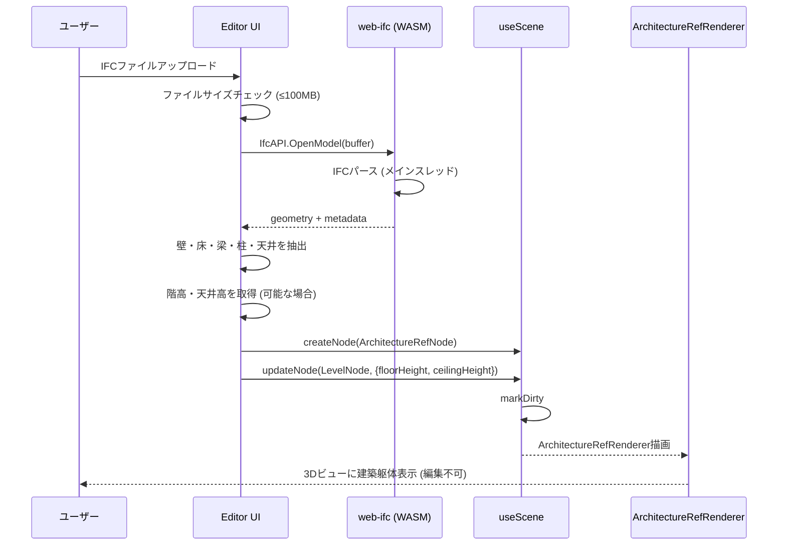

**詳細ステップ**:
1. ユーザーがIFCファイルをドラッグ&ドロップまたはファイル選択でアップロード
2. ファイルサイズを検証（100MB以下）
3. web-ifc WASMでブラウザ内パース（メインスレッド）
4. IfcWall, IfcSlab, IfcBeam, IfcColumn, IfcCovering のジオメトリを抽出
5. IfcBuildingStorey から階高・天井高を取得（REQ-108、条件付き）
6. ArchitectureRefNodeを作成（表示のみ、編集不可）
7. Level情報を更新（階高反映）

### 機能2: ゾーン描画と負荷概算 🔵

**信頼性**: 🔵 *設計文書 §3.2・要件REQ-101~105, REQ-110*

**関連要件**: REQ-101, REQ-102, REQ-103, REQ-104, REQ-105, REQ-110

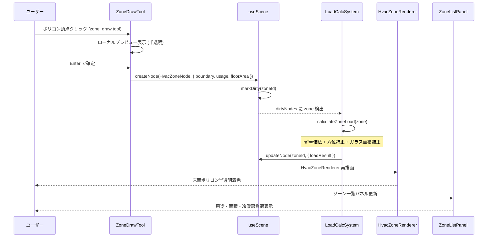

**詳細ステップ**:
1. ゾーニングフェーズで「ゾーン描画」ツールを選択
2. 建築平面上でクリックしてポリゴン頂点を指定
3. ポリゴンが半透明着色でリアルタイムプレビュー
4. Enterで確定、ゾーン名・用途・設計条件を入力
5. HvacZoneNodeが作成され、dirtyNodesにマーク
6. LoadCalcSystemがuseFrame内で検出し、負荷概算を実行
7. 計算結果（coolingLoad, heatingLoad, requiredAirflow等）がノードに保存
8. ゾーン一覧パネルに集計表示

### 機能3: 機器配置 🔵

**信頼性**: 🔵 *設計文書 §6 Phase 2・要件REQ-201~207*

**関連要件**: REQ-201, REQ-202, REQ-203, REQ-204, REQ-205, REQ-206, REQ-207

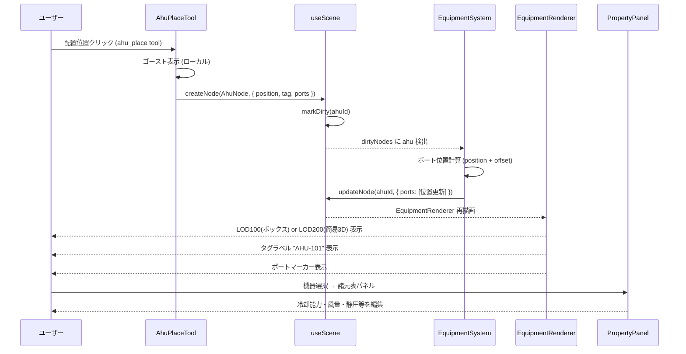

**詳細ステップ**:
1. 機器フェーズで配置ツール（AHU/PAC/FCU/制気口）を選択
2. 3Dビュー上でクリックして配置位置を指定（ゴーストプレビュー）
3. 機器ノードが作成、ポートが自動定義（給気口、還気口、冷水入口等）
4. EquipmentSystemがポート位置を計算
5. LOD100（ボックス）またはLOD200（簡易3D）で表示
6. タグ名（"AHU-101"等）がラベル表示
7. 諸元表パネルで性能諸元を入力・編集

### 機能4: 負荷→機器容量自動マッチング 🔵

**信頼性**: 🔵 *設計文書 §6 Phase 2・要件REQ-205*

**関連要件**: REQ-205

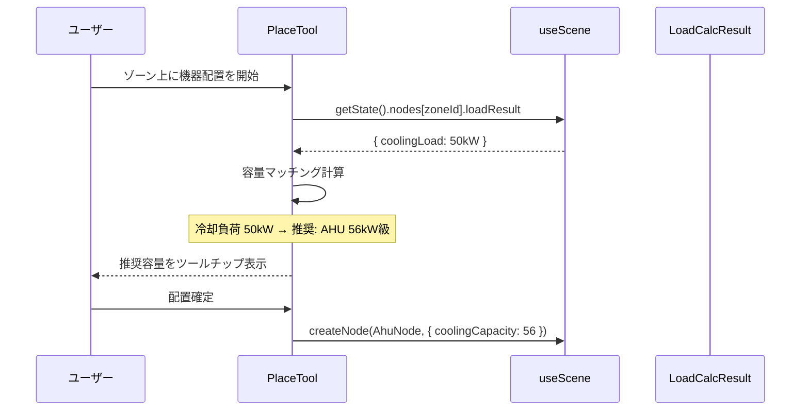

### 機能5: ダクトルーティング（Phase 3 — 後続） 🔵

**信頼性**: 🔵 *設計文書 §4.3・要件REQ-301~305*

**関連要件**: REQ-301, REQ-302, REQ-303, REQ-304, REQ-305

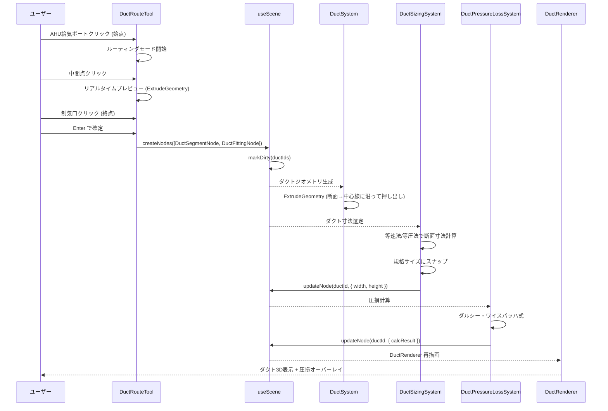

### 機能6: 数量拾い出し（Phase 5 — 後続） 🔵

**信頼性**: 🔵 *設計文書 §3.6・要件REQ-501, REQ-502*

**関連要件**: REQ-501, REQ-502

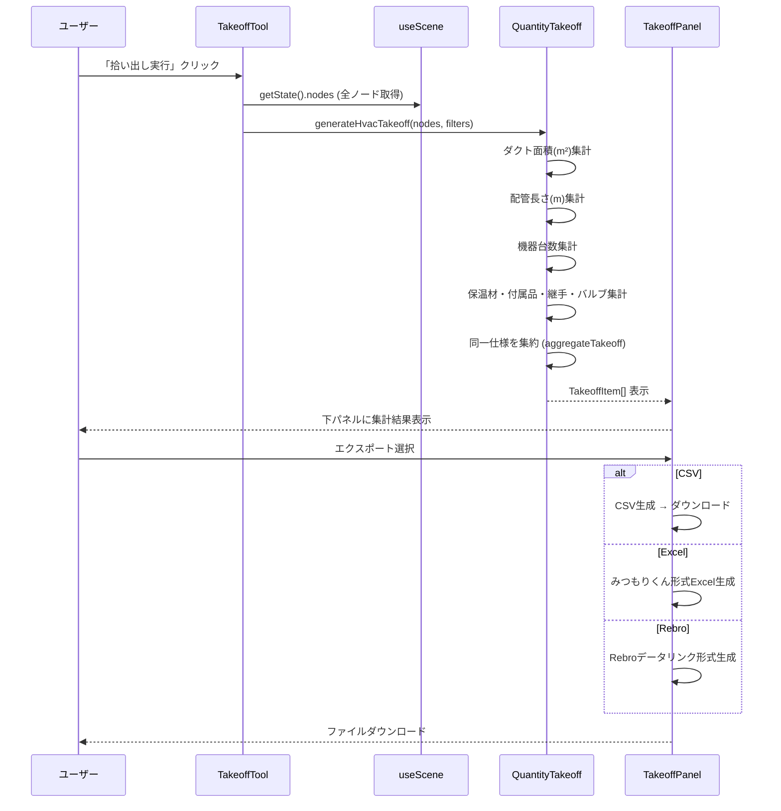

---

## データ処理パターン

### 同期処理 🔵

**信頼性**: 🔵 *既存useFrameパターン*

- **useFrame内処理**: ダーティノードの検出→計算→更新。1フレーム16ms以内
- **ノードCRUD**: `useScene.createNode/updateNode/deleteNode` は同期
- **undo/redo**: Zundoによる同期的な状態巻き戻し/進め

### 非同期処理 🟡

**信頼性**: 🟡 *IFC処理・DB同期の推測*

- **IFC読込**: web-ifc WASMのパース（メインスレッド、ブロッキング）。将来Worker化候補
- **Supabase同期**: プロジェクトデータの保存・読込は非同期
- **IFC出力**: Supabase Edge Functions呼び出し（非同期）

### バッチ処理 🔵

**信頼性**: 🔵 *設計文書 §3.6*

- **数量拾い出し**: 全ノードを一括走査して集計
- **圧損一括計算**: Phase 5で系統全体の圧損を一括計算
- **積算出力**: 集計結果をCSV/Excel/Rebro形式に一括変換

---

## エラーハンドリングフロー 🟡

**信頼性**: 🟡 *既存実装パターンから妥当な推測*

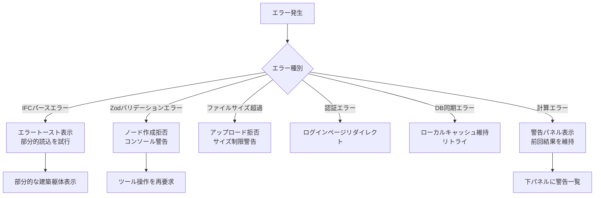

---

## 状態管理フロー

### フロントエンド状態管理 🔵

**信頼性**: 🔵 *既存3ストアアーキテクチャ*

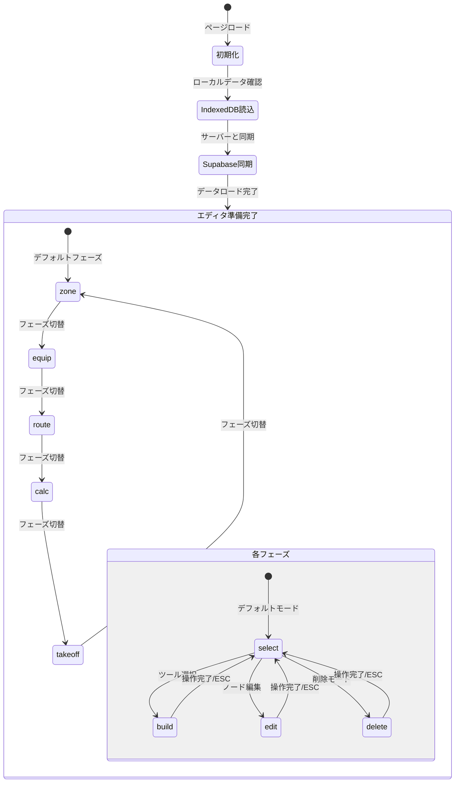

### undo/redo フロー 🔵

**信頼性**: 🔵 *既存Zundoパターン*

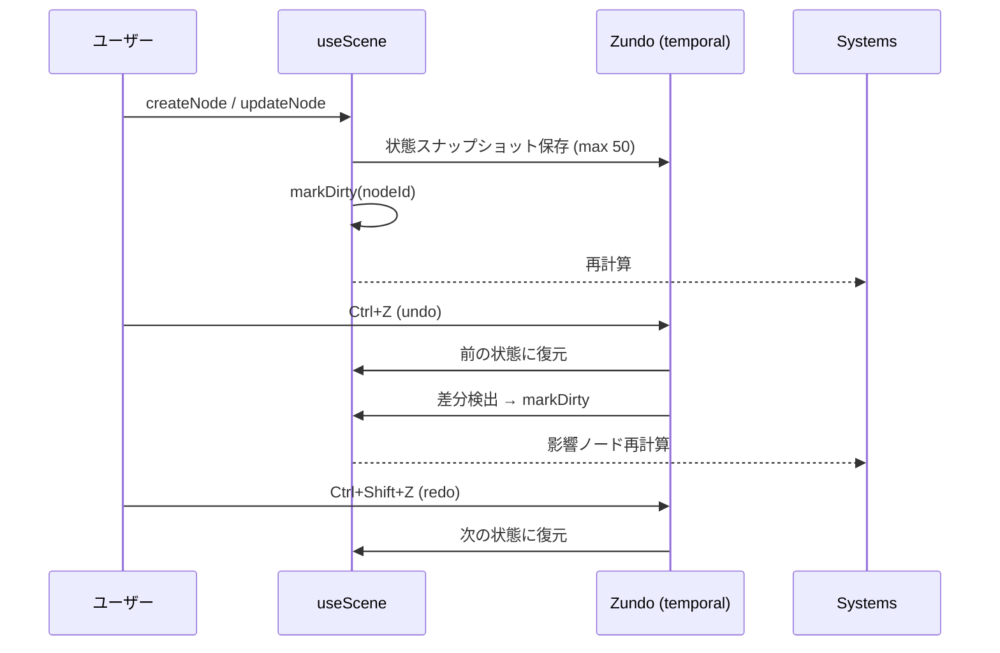

---

## 選択パスフロー 🔵

**信頼性**: 🔵 *既存SelectionPath・設計文書 §2.1*

```typescript
// @kuhl/viewer の選択パス
type SelectionPath = {
  plantId: PlantNode['id'] | null
  buildingId: BuildingNode['id'] | null
  levelId: LevelNode['id'] | null
  zoneId: HvacZoneNode['id'] | null
  selectedIds: BaseNode['id'][]  // 機器・ダクト・配管のマルチセレクト
}
```

階層ガード: 親ノード変更時は子の選択をリセット。

---

## データ永続化フロー 🔵

**信頼性**: 🔵 *既存永続化パターン・ユーザヒアリング*

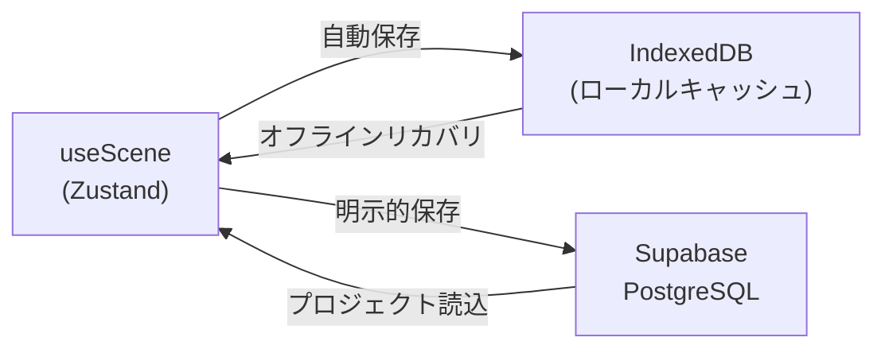

---

## 関連文書

- **アーキテクチャ**: [architecture.md](architecture.md)
- **型定義**: [interfaces.ts](interfaces.ts)
- **DBスキーマ**: [database-schema.sql](database-schema.sql)
- **API仕様**: [api-endpoints.md](api-endpoints.md)

## 信頼性レベルサマリー

- 🔵 青信号: 13件 (81%)
- 🟡 黄信号: 3件 (19%)
- 🔴 赤信号: 0件 (0%)

**品質評価**: 高品質 — ほぼ全てのデータフローが設計文書・既存実装に裏付けられている
